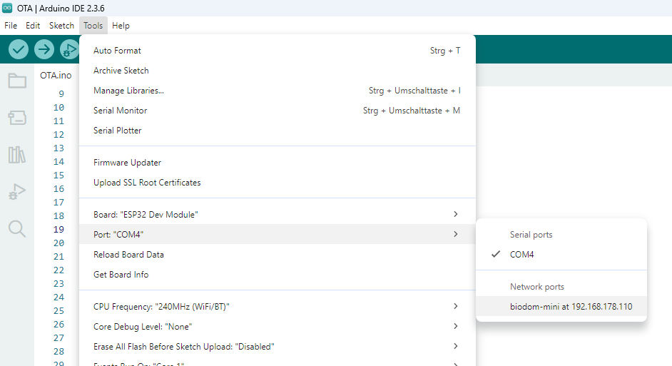

# OTA (Over-The-Air)

OTA ermöglicht das Hochladen des Codes über WLAN.

## 📦 Installation & Konfiguration

Für ein OTA-Update müssen folgende Angaben in die `patformio.ini` eingetragen werden:

```ini
[platformio]
extra_configs = secrets.ini

[env:esp32-ova]
; ...
upload_protocol = espota
upload_port = biodom-mini-dev
upload_flags = --auth=${common.ota_password}
```

* `espota` steht für "ESP OTA"-Protokoll.
* Der `upload_port` ist der Hostname oder die IP-Adresse.
* In `upload_flags` ist das Passwort angegeben - hier indirekt über die separate Ini-Datei `secrets.ini`:

  ```ini
  [common]
  ota_password = 4321
  ```
  **WICHTIG:** `secrets.ini` sollte per `.gitignore` vom Git-Repository ausgeschlossen werden!

**Anmerkung:**

Mit der Arduino IDE kann der Code auch drahtlos hochgeladen werden.
Wenn das Programm läuft, ist der Port des Entwicklungsboards keine COM-Schnittstelle mehr, sondern ein Netzwerk-Anschluss (Menüpunkt Tools/Port, u.U. erst nach Neustart sichtbar):



## 💻 Beispiel-Code

s. [sketches/OTA_Test](/sketches/OTA_Test/OTA_Test.ino)
